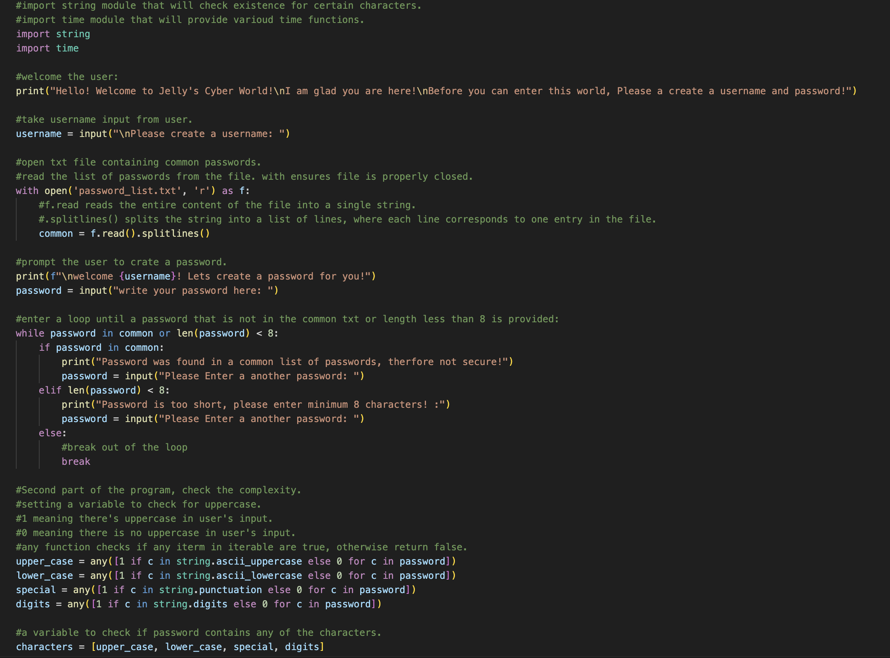
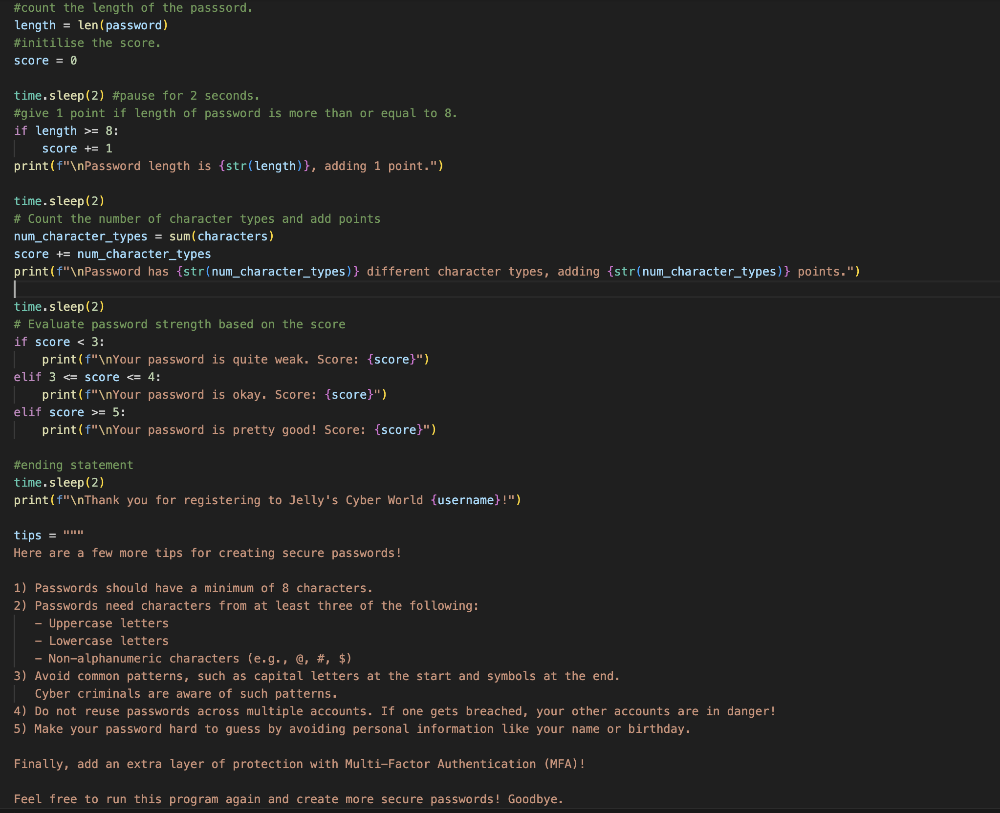
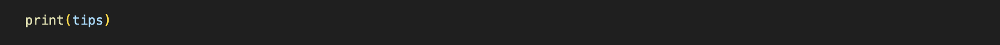
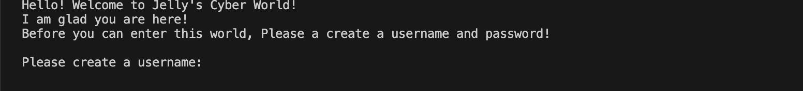
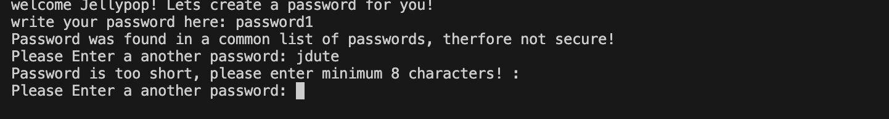
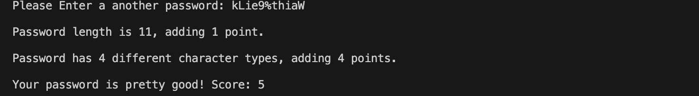
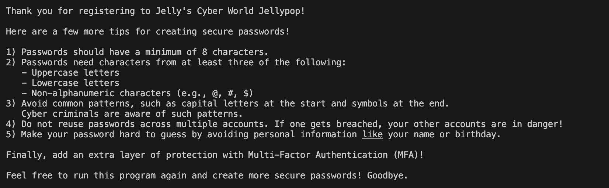

# Secure Password Checker Program

Welcome to the **Secure Password Checker Program**! This Python script helps create secure passwords by evaluating their strength and providing tips for improvement.

## How It Works

The program performs the following steps:
1. **User Input**: The user creates a username and password.
2. **Security Checks**: The password is checked against common passwords and its length is validated.
3. **Complexity Evaluation**: The program checks the password for:
   - Uppercase letters
   - Lowercase letters
   - Special characters
   - Digits
4. **Score Calculation**: Based on the password's length and complexity, the script calculates a score to evaluate its strength.

## The Code

##How the Program Runs: 

1. Welcomes the user and prompts them to create a username:

2. Prompts them to create a password: 

3. Prompts the user to enter secure password: 

4. Gives points based on length of password and the character types (upper_case, lower_case, special, digits).

5. Gives user advice on creating secure passwords:

